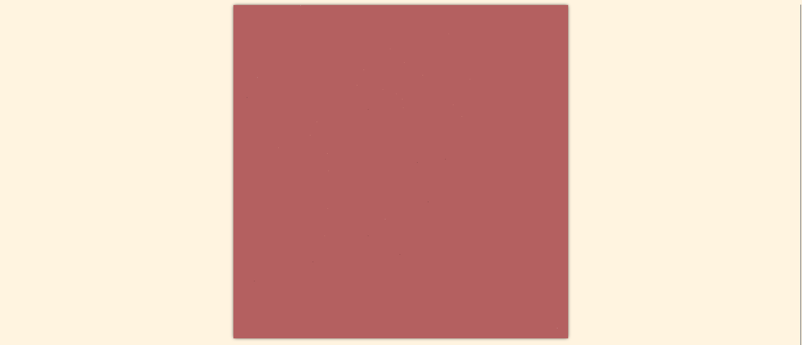
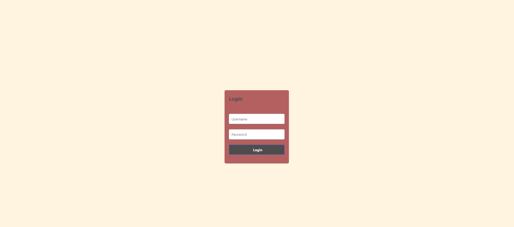

# CommunityDraw Vuejs3

This project is a clone of the popular website r/place, built using Vue.js3.

## About this project

This project is a clone of r/place, built using Vue.js3. It allows users to place pixels on a blank canvas, using a limited palette of colors. The canvas is shared among all users, and updates in real-time, so users can see each other's contributions as they happen.

## Getting started

To run this project locally, you will need to have Node.js installed on your computer. Once you have Node.js installed, follow these steps:

1. Clone this repository to your local machine.
2. Navigate to the project directory in your terminal.
3. Run the command `npm install` to install the project dependencies.
4. Run the command `npm run dev` to start the development server.
5. Open your browser and go to http://localhost:5173 to view the app.

## Usage

To use this app, simply click on the canvas to place a pixel. You can choose from a limited palette of colors by clicking on the color buttons at the bottom of the screen. The canvas updates in real-time, so you can see your pixel and other users' pixels as they are placed.

## Screenshots

Home page

Login page

Register page
